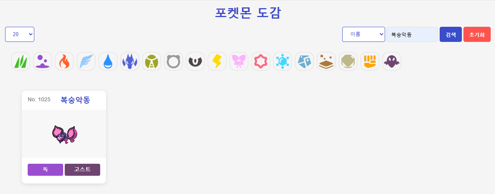

# Pokedex

포켓몬 api를 활용하여 포켓몬 도감 만들기

## 1. 목표와 기능

### 1.1 목표

- 기간 안에 페이지 완성하기
- HTML, CSSm JS를 이용한 포켓몬 도감 페이지 만들기
- 시멘틱 마크업, 접근성, SEO, CSS 네이밍 방법론 고려하기
- 여러가지 화면에서도 문제 없는 반응형으로 작업하기
- API 활용하여 값 뿌려주기

### 1.2 기능

특수한 기능은 없으나 고려해야 할 부분을 정리

1. HTML
   - 시맨틱 마크업 준수
   - 접근성 고려
   - SEO 고려
2. CSS
   - 반응형 제작
   - CSS 네이밍 방법론 고려
3. JavaScript
   - ~~Class 활용~~
   - API 활용

### 1.3 팀 구성

개인 프로젝트로 1인 개발.

## 2. 개발 환경 및 배포 URL

### 2.1 개발 환경

- VSCode
- API [pokeapi-js-wrapper](https://github.com/PokeAPI/pokeapi-js-wrapper?tab=readme-ov-file)

### 2.2 배포 URL

- https://jieunheo.github.io/Pokedex/

## 3. 요구사항 명세와 기능 명세

1. 시멘틱 마크업, 반응형 웹, 접근성, SEO, CSS 네이밍 방법론 등을 고려해서 작업.
2. 모바일 화면도 고려하여 페이지 구현.
3. 스크롤시 헤더가 고정.
4. 자바스크립트로 스크롤 탑 버튼
   1. 스크롤 탑 버튼은 스크롤시 나타남.
   2. 스크롤 탑 버튼은 푸터 아래로 내려가지 않음.
   3. 스크롤 탑 버튼을 누르면 스크롤이 최상단으로 올라감. (부드럽게)
5. API를 사용한 구현
   1. (필수) 포켓몬 리스트 출력 (무한 스크롤링)
   2. (필수) 포켓몬 상세 정보 출력
   3. (필수) 검색 (번호/이름 등을 이용한 검색)
   4. 한글로 데이터 출력
   5. 필터 (타입 별 필터 기능)
   6. 도구/아이템 페이지 추가

목표기능 페이지: [pokemonkorea.co.kr 도감페이지](https://pokemonkorea.co.kr/pokedex)

## 4. 프로젝트 구조와 개발 일정

### 4.1 프로젝트 구조

### 4.2 개발 일정

25.08.27(수) ~ 25.09.01(월), 평일 기준 총 3일(주말, 금 제외)

노션 간트 사용

## 5. 화면

### 5.1 pc 화면

메인 화면

검색 화면

### 5.2 mobile 화면

## 6. 메인 기능

- 시멘틱 태그 사용 (header, main, footer, h1, h2, ...)
- flex 사용
- input 태그에 텍스트 필수 입력 체크 (required)
- 팝업 (JavaScript 없이 팝업 위치만 스타일링)
- CSS 방법론 - BEM 방식으로 진행
- 헤더 상단 고정, to top 버튼 우측 하단 고정
- 가상요소와 backgroung-image 사용
- 반응형 웹 테스트 (pc/mobile 2단계)
  - 모바일 퍼스트 형식으로 진행
  - pc 화면에서 배경색 확장
  - 모바일 메뉴 햄버거 형식
  - 모바일에서만 footer nav 출력
- API를 이용하여 포켓몬 출력
  - 리스트 출력
  - 상세 보기
  - 검색

## 7. 에러와 에러 해결

### 7.1 무한 스크롤

처음 리스트를 한 페이지 가져오고 이후 스크롤에 따라 이후 페이지를 가져오는 무한 스크롤 기능을 추가 했다.
한 번에 20개씩, 스크롤이 어느정도 내려오면 가져올 수 있도록 하기 위해서 observer를 사용하였다.

1. 글씨가 가려져서 인식 못함
   처음에는 로딩중이라는 텍스트에 observer를 연결해서 하려 했는데 이게 값을 한 차례 가져오고 나면 글씨가 display none 처리가 되어서 보이질 않으니 인식을 못하는 거 같았다.
   더보기 버튼을 하나 만들어서 해당 버튼에 observer를 연결해서, 버튼이 보이더라도 이상하지 않은 디자인을 만들었다.
   리스트가 가져와지지 않을 때 해당 버튼을 클릭하면 가져올 수 있도록 기능도 추가했다.

2. 처음 접속한 순간 두 번 리스트 가져옴
   더보기 버튼을 만들어서 observer를 연결해두고 계속 보이도록 했더니 처음 사이트를 접속한 순간에 2번 값을 가져오는 문제가 생겼다.
   DOM이 그려진 순간에 1번, observer 연결한 버튼이 보이는 순간에 한번...
   setTimeout을 이용하여 DOM 생성 2초 후에 버튼을 observer로 감지하도록 했다.
   나름 원하는 방식으로 굴러가는 거 같다.

### 7.2 limit 필터

한 번에 가져오는 포켓몬의 개수를 설정하는 필터 기능을 추가했다.

1. url 전송
   limit을 담당하는 select box의 값이 변동될 때 마다 사이트 href 값을 이용해서 새 화면으로 이동했다.
   이러다보니 화면 전체를 새로 가져오게 되다보니, 기본적으로 가지고 있어야 하는 값을 자꾸 다시 받아오는 문제가 생겼다.

2. JavaScript를 이용한 화면 업데이트
   위의 문제를 보완하기 위해서 history.pushState를 이용하여 사이트 url의 모양만 수정 시키고 전송을 하지 않게 했다.
   그리고 new URL(window.location.href).searchParams를 이용해서 파라미터 값을 가져와 값을 세팅하는 코드를 추가했다.
   화면을 아예 새로 가져오는 것이 아니라 container 내부의 HTML 값을 없애고 다시 넣어주는 작업 방식으로 진행했다.

### 7.3 포켓몬 데이터 가져오기

기본적으로 포켓몬은 번호, 이름, 이미지, 타입을 가져와 뿌려주고, 포켓몬을 클릭하면 해당하는 포켓몬의 상세 정보를 가져와서 모달에 뿌려주는 기능을 추가했다.
가져올 수 있는 정보는 최대한 많이 가져오려고 노력했다.

1. 타입 정보 가져오기
   타입이 하나인 경우도 있고 둘인 경우도 있어서, 타입의 값 개수 만큼 반복해서 가져올 수 있도록 했다.
   값은 영어로 되어있는 상황이라, 각 타입별 컬러를 CSS class로 미리 넣어두고 값을 가져올 때 class를 적용해서 배경 색을 주었다.
   타입의 종류와 한글번역의 값을 가지고 있는 객체를 하나 만들어서 이 객체를 이용해 타입의 한글 값을 가져올 수 있도록 했다.

2. 타입 외 기본 정보 가져오기
   분류, 키, 몸무게 등의 기본 정보를 가져오려 했다.
   기본적으로 제공하는 값을 사용하는데,

3. 상세 이이미지 가져오기
   상세 이미지를 가져오려 하는데,

### 7.4 이름 검색

검색 기능

### 7.5 한글 매핑

한글 매핑

## 8. 개발하며 느낀점

1. 완성도
   API를 이용해서 그럴싸한 사이트를 만들어낸다는 것이 목표였는데, 반 정도 성공한 거 같다.
   투자한 시간이 부족해서 완성도가 많이 떨어지긴 하지만... 그래도 원하는 방향은 어느정도 성공해서 기분이 좋았다.

2. API 활용
   API를 이용해서 만든다는 것이 가장 중요한 부분이었는데, API 설명서를 읽고 해석하는 것이 매우 어려웠다.
   AI의 도움을 받아서 API를 가져온느 것을 성공했다.
   API의 결과값으로 온 데이터를 직접 콘솔로 출력해보고 어떤 값이 있는지 구경하는 게 생각보다 재미있었다.
   어떤 값을 어떻게 가져오고 저장하고 뿌려줄지 고민하는 시간이 꽤 길었던 거 같다.

   값을 가져 올 때 async, await을 열심히 사용했는데, 너무 여기저기 사용한 것은 아닌지 걱정이 되었다.
   더 깔끔하게 작성할 수도 있을 거 같은데 쉽지 않다.
   이 부분에 대해서 공부가 더 필요한 거 같다.

3. AI 활용
   AI를 활용해서 작업을 진행했다. 뤼튼 무료 버전을 이용했다.
   뤼튼을 사용하게 된 이유는... 그냥 AI 링크를 여러개 즐겨찾기 해뒀는데, 그 중 눌린 AI 아무거나였다.
   그래도 괜찮았던게, 디자인을 알아서 넣어주는데 나쁘지 않았다.
   코드도 나름 깔끔하게 정리해주는 거 같았고, API 사이트 링크를 넘겨서 내용을 분석하고 알려달라고 하는 질문에도 나름 잘 대답해줬던 거 같다.

   개인적으로 직접 알아보고 검색하는 쪽이 맘 편한 사람이지만 AI를 이용해서 개발을 하니 꽤나 시간이 단축되는 거 같았다.
   하지만... 그건 어디까지나 알아볼만한 코드였을 때 얘기지, 오류가 났을 때 대처가 너무 힘들었다.
   무료 버전이라서 더 그랬을 수 있긴 하지만, 질문을 잘 하고 답변을 잘 써먹기 위해서는 공부를 더 해야겠다는 생각이 들었다.

4. meta
   이번에는 meta값에 대해 검색을 해보면서 적용하는 것도 해봤다.
   meta 값을 잘 입력해야 검색엔진이 해당 사이트를 잘 파악할 수 있다는 것을 알았다.
   파비콘 뿐 아니라 title이나 description, url, image 등의 여러가지 값을 넣어보았다.
